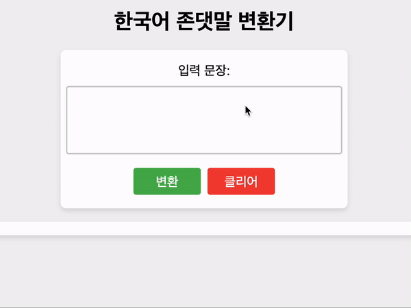

# korean Formal Convertor Using Deep Learning



존댓말과 반말은 한국어에서만 존재합니다, 본 모델은 반말(informal)을 존댓말(formal)로 바꿔주는 변환기(convertor) 입니다. <br>
*확보한 존댓말 데이터셋에는 "해요체"와 "합쇼체" 두 종류가 존재했지만 본 모델은 "해요체"로 통일하여 변환하기로 결정했습니다.

|합쇼체|*해요체|
|------|---|
|안녕하십니까.|안녕하세요.|
|좋은 아침입니다.|좋은 아침이에요.|
|바쁘시지 않았으면 좋겠습니다.|바쁘시지 않았으면 좋겠어요.|

## 배경
- 이전에 존댓말과 반말을 구분하는 분류기(https://github.com/jongmin-oh/korean-formal-classifier) 를 학습했습니다.<br>
분류기로 말투를 나눠 사용하려했지만, 상대적으로 존댓말의 비중이 적었고 반말을 존댓말로 바꾸어 존댓말 데이터의 비중을 늘리기위해 만들게 되었습니다.

## 한국어 존댓말 변환기
- 존댓말 변환기는 T5모델 아키텍쳐를 기반으로한 Text2Text generation Task를 수행함으로 반말을 존댓말로 변환하여 사용할 수 있습니다.
- 바로 사용하실 분들은 밑에 예제 코드 참고해서 huggingFace 모델('j5ng/et5-formal-convertor') 다운받아 사용하실 수 있습니다.

## Base on PLM model(ET5)
 - ETRI(https://aiopen.etri.re.kr/et5Model)

## Base on Dataset
 - AI허브(https://www.aihub.or.kr/) : 한국어 어체 변환 코퍼스
    1. KETI 일상오피스 대화 1,254 문장
    2. 수동태깅 병렬데이터

 - 스마일게이트 말투 데이터 셋(korean SmileStyle Dataset)

### Preprocessing
 1. 반말/존댓말 데이터 분리("해요체"만 분리)
    - 스마일게이트 데이터에서 (['formal','informal']) 칼럼만 사용
    - 수동태깅 병렬데이터에서 ["*.ban", "*.yo"] txt 파일만 사용
    - KETI 일상오피스 데이터에서(["반말","해요체"]) 칼럼만 사용

 2. 데이터 셋 병합(3가지 데이터 셋 병합)
 3. 마침표(.)와 쉼표(,)제거
 4. 반말(informal) 칼럼 중복 제거 : 1632개 중복데이터 제거

### 최종 학습데이터 예시
|informal|formal|
|------|---|
|응 고마워|네 감사해요|
|나도 그 책 읽었어 굉장히 웃긴 책이였어|저도 그 책 읽었습니다 굉장히 웃긴 책이였어요|
|미세먼지가 많은 날이야|미세먼지가 많은 날이네요|
|괜찮겠어?|괜찮으실까요?|
|아니야 회의가 잠시 뒤에 있어 준비해줘|아니에요 회의가 잠시 뒤에 있어요 준비해주세요|

#### total : 14,992 쌍

***

## How to use
```python
import torch
from transformers import T5ForConditionalGeneration, T5Tokenizer

# T5 모델 로드
model = T5ForConditionalGeneration.from_pretrained("j5ng/et5-formal-convertor")
tokenizer = T5Tokenizer.from_pretrained("j5ng/et5-formal-convertor")

device = "cuda:0" if torch.cuda.is_available() else "cpu"
# device = "mps:0" if torch.cuda.is_available() else "cpu" # for mac m1

model = model.to(device) 

# 예시 입력 문장
input_text = "나 진짜 화났어 지금"

# 입력 문장 인코딩
input_encoding = tokenizer("존댓말로 바꿔주세요: " + input_text, return_tensors="pt")

input_ids = input_encoding.input_ids.to(device)
attention_mask = input_encoding.attention_mask.to(device)

# T5 모델 출력 생성
output_encoding = model.generate(
    input_ids=input_ids,
    attention_mask=attention_mask,
    max_length=128,
    num_beams=5,
    early_stopping=True,
)

# 출력 문장 디코딩
output_text = tokenizer.decode(output_encoding[0], skip_special_tokens=True)

# 결과 출력
print(output_text) # 저 진짜 화났습니다 지금.
```

***

## With Transformer Pipeline
```python
import torch
from transformers import T5ForConditionalGeneration, T5Tokenizer, pipeline

model = T5ForConditionalGeneration.from_pretrained('j5ng/et5-formal-convertor')
tokenizer = T5Tokenizer.from_pretrained('j5ng/et5-formal-convertor')

typos_corrector = pipeline(
    "text2text-generation",
    model=model,
    tokenizer=tokenizer,
    device=0 if torch.cuda.is_available() else -1,
    framework="pt",
)

input_text = "널 가질 수 있을거라 생각했어"
output_text = typos_corrector("존댓말로 바꿔주세요: " + input_text,
            max_length=128,
            num_beams=5,
            early_stopping=True)[0]['generated_text']

print(output_text) # 당신을 가질 수 있을거라 생각했습니다.
```

## Thanks to
존댓말 변환기의 학습은 인공지능산업융합사업단(AICA)의 GPU 리소스를 지원받아 학습되었습니다.

